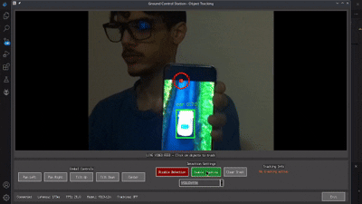
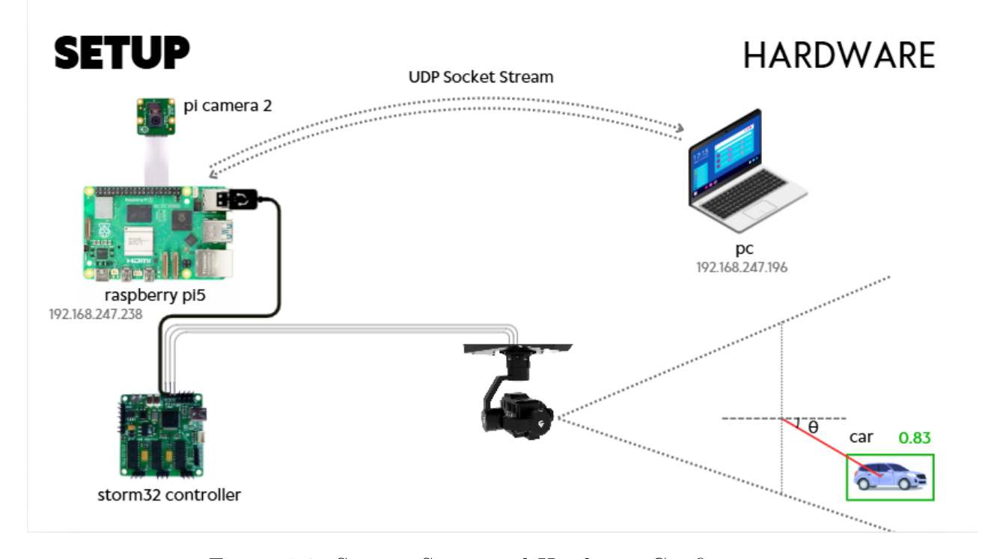
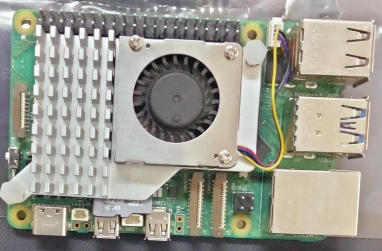
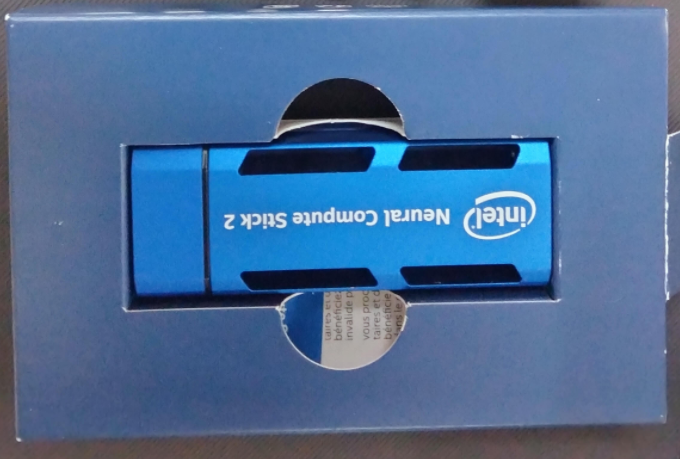
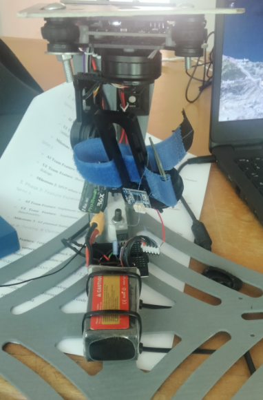
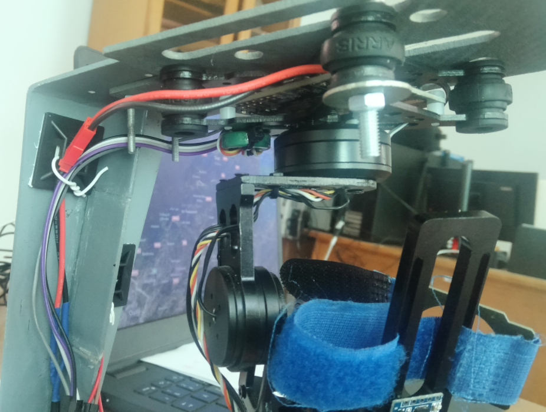
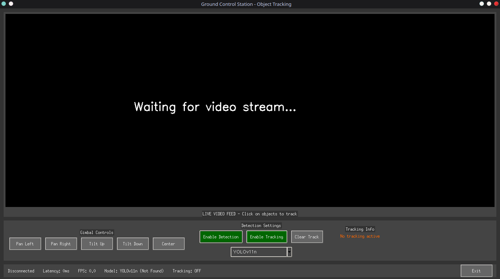

# Aerial Surveillance Gimbal System for UAV Defence & Security applications

## Overview

A hardware-software system for real-time object detection and tracking using a Raspberry Pi-controlled gimbal. Detects and tracks targets (e.g., vehicles, pedestrians, tanks, armed vehicles, soldiers) in aerial imagery, with integration to a ground control UI.


*demo showcasing the system with the PC configured as the processing unit*

This project was developed as part of a security drone internship at Electronic Systems Research and Development Unit (Feb-Jun 2025), combining AI vision with mechanical control.

## Features
- **Object Detection**: Uses YOLOv8 small or HyperDet CNN models, pre-trained on ImageNet and fine-tuned on Roboflow dataset for custom classes.
- **Tracking**: Implements CSRT and DeepSort for robust, occlusion-resistant tracking.
- **Hardware Integration**: Raspberry Pi 5 with Pi Camera 2 on Storm32 gimbal; sends motor signals for physical tracking.
- **Streaming & UI**: UDP socket video stream to PC; GroundControl UI with sensor panels, error handling, and interactive object selection.
- **Performance**: Optimized for edge devices with Movidius Neural Compute Stick.

## System Architecture

*System overview showing the complete pipeline*

- **Raspberry Pi Side**: Captures frames, controls gimbal via signals, streams video/data via UDP.
- **PC Side**: Receives stream, runs inference, displays UI, allows operator to select/track objects and what models to use.
  
  *P.S: the inference runing unit could be configures to be either the raspberry + NCS 2, PC's CPU or GPU, in this demonstration the CPU was used to obtain the average results*


## 📁 Repository Structure
```
Object_detection_and_tracking_for_UAV_application/
│
├── 📄 README.md           # Main project documentation
├── 📁 docs/               # Additional documentation
│   ├── system_diagram.png    # Your architecture diagram
│   ├── hardware_setup/       # Photos of components
│   └── project_report.pdf    # Your academic report
├── 📁 src/                # Source code
│   ├── 📁 client_server/     # clent server configuration
│       ├── server.py            # Raspberry side: It streams video frames and detection results via UDP, separate threads for frame, inference, and communication.
│       ├── client_version2.py   # PC side: ground control station with a Tkinter GUI that receives UDP video streams and performs YOLO inference. features dual tracking    │       │                          modes (YOLO's built-in, and OpenCV's CSRT), interactive object selection via mouse clicks, and gimbal control commands.
│       └── client_version1.py   # same as above, Simplified unified pipeline using only YOLO's persist tracking for lower CPU/GPU overhead
│   ├── model_training/   
│   ├── model_training/       # Training scripts
│   ├── raspberry_pi/         # Pi deployment code
│   ├── ground_control_ui/    # UI application code
│   └── gimbal_control/       # Motor control scripts
├── 📁 models/             # Trained model weights
│   ├── yolov8s_best.pt
│   └── hyperdet_cnn_best.pt
├── 📁 media/              # Demo materials
│   ├── demo_video.mp4        # Short demonstration
│   ├── screenshots/          # UI and detection screenshots
│   └── component_photos/     # Hardware photos
└── 📁 datasets/           # Dataset info (links only)
    └── dataset_sources.md
```

### Hardware Setup
- **Main Controller**: Raspberry Pi 4 or 5 
- **AI Accelerator**: Intel Movidius Neural Compute Stick 2 
- **Gimbal**: 3-axis gimbal 
- **Gimbal Controller**: Storm32 BGCC 
- **Camera**: Pi Camera v2 
- **Communication**: UDP socket streaming

## Results & Metrics
- Accuracy: 90%+ on custom dataset (mAP@0.5 ~0.85 for YOLOv8s).
- FPS: ~5 FPS inference on Raspberry Pi + Movidus NCS 2, 5-12 FPS on CPU (intel I3 11th gen), and 40 FPS on Nvidia RTX 4060 8G
- Screenshots:
  - UI Dashboard: 
  - Detection output: 
  - Gimbal position adjustments data: to be sent from the processing unit (PC's CPU/GPU, or Raspberry Pi + NCS) to the gimbal controller 


## Installation
1. Clone the repo: `git clone https://github.com/aminemoussi/Object_detection_and_tracking_for_UAV_application.git`
2. Install dependencies: `pip install -r requirements.txt` (Includes ultralytics, opencv-python, deepsort-realtime, etc.)
3. Download models: Place YOLOv8s.pt and HyperDet weights in `/models/` (links in models/README.md).
4. Hardware setup: Connect Pi Camera to Raspberry Pi 5, gimbal to Storm32 controller, Movidius stick for acceleration.

## Usage
- **Run on Raspberry Pi (Detection & Gimbal Control)**: `python gimbal_tracker.py --model yolov8s.pt --tracker csrt`
- **Run PC UI (Ground Control)**: `python ground_control_ui.py --ip 192.168.247.196 --port 5000`
- Select object in UI to initiate tracking; gimbal adjusts in real-time.


